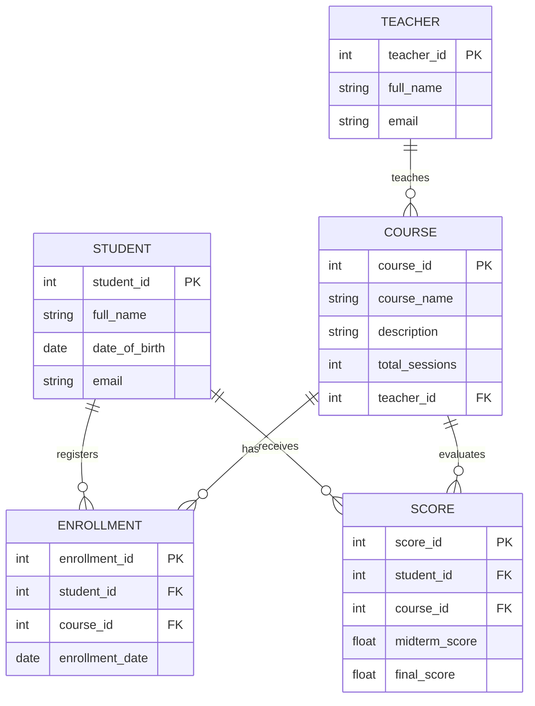

```mermaid
erDiagram

    STUDENT {
        int student_id PK
        string full_name
        date date_of_birth
        string email
    }

    TEACHER {
        int teacher_id PK
        string full_name
        string email
    }

    COURSE {
        int course_id PK
        string course_name
        string description
        int total_sessions
        int teacher_id FK
    }

    ENROLLMENT {
        int enrollment_id PK
        int student_id FK
        int course_id FK
        date enrollment_date
    }

    SCORE {
        int score_id PK
        int student_id FK
        int course_id FK
        float midterm_score
        float final_score
    }

    STUDENT ||--o{ ENROLLMENT : registers
    COURSE  ||--o{ ENROLLMENT : has

    TEACHER ||--o{ COURSE : teaches

    STUDENT ||--o{ SCORE : receives
    COURSE  ||--o{ SCORE : evaluates
```
